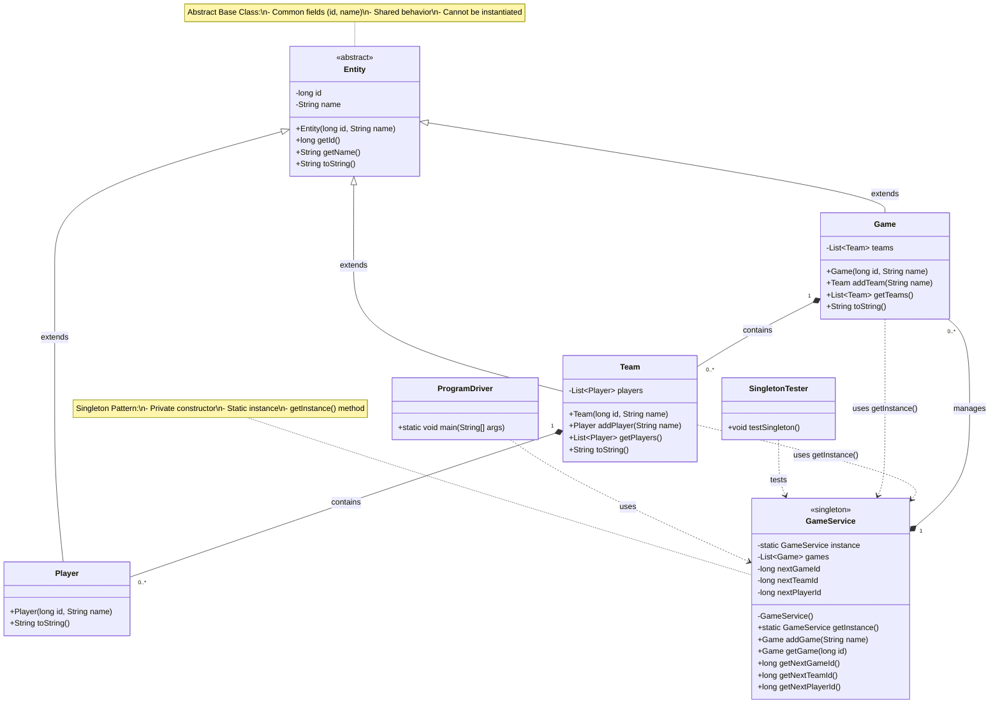

# Updated UML Diagram - Singleton GameService with Entity Hierarchy
**TODO: Fix text not fitting in box**

## Key Design Patterns and Relationships:

1. **Singleton Pattern**: GameService ensures only one instance exists
2. **Inheritance Hierarchy**: Entity is the abstract base class for Game, Team, and Player
3. **Composition**: 
   - GameService manages multiple Games
   - Each Game contains multiple Teams
   - Each Team contains multiple Players
4. **ID Management**: GameService centrally manages unique IDs for all entities

## Class Responsibilities:

- **Entity**: Abstract base providing id and name fields for all game objects
- **GameService**: Singleton managing all games and providing unique IDs
- **Game**: Represents a game session with teams
- **Team**: Represents a team with players
- **Player**: Represents an individual player
- **ProgramDriver**: Main entry point demonstrating the system
- **SingletonTester**: Tests the singleton pattern implementation
