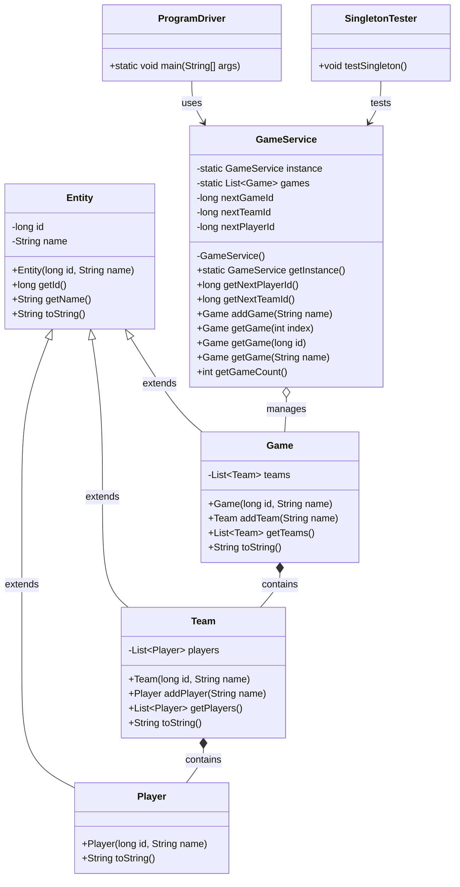

# Singleton GameService UML Diagram

This UML diagram illustrates the structure and relationships of the Singleton GameService implementation.
**TODO: Fix text fititng properly into boxes**

## Key Design Patterns

### Singleton Pattern
- Implemented in `GameService` class
- Ensures only one instance exists throughout the application
- Provides global access point via `getInstance()`

### Iterator Pattern
- Used in `addGame()`, `getGame()`, `addTeam()`, and `addPlayer()` methods
- Searches for existing entities before creating new ones
- Prevents duplicate entries

### Inheritance Hierarchy
- `Entity` serves as the base abstract class
- `Game`, `Team`, and `Player` inherit from `Entity`
- Common attributes (id, name) and behaviors (toString) are defined in the base class 
